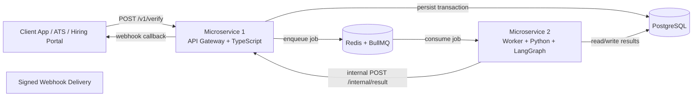
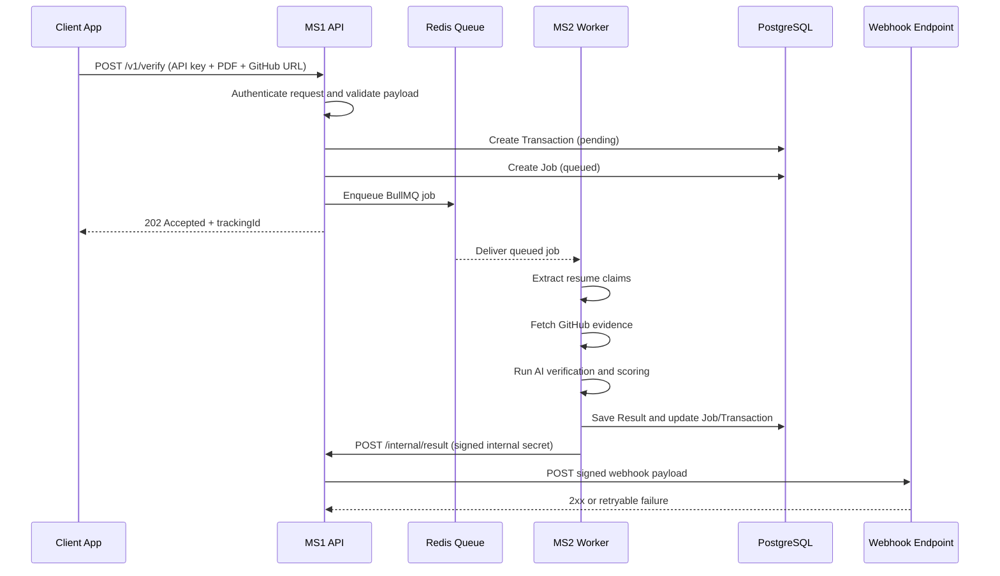
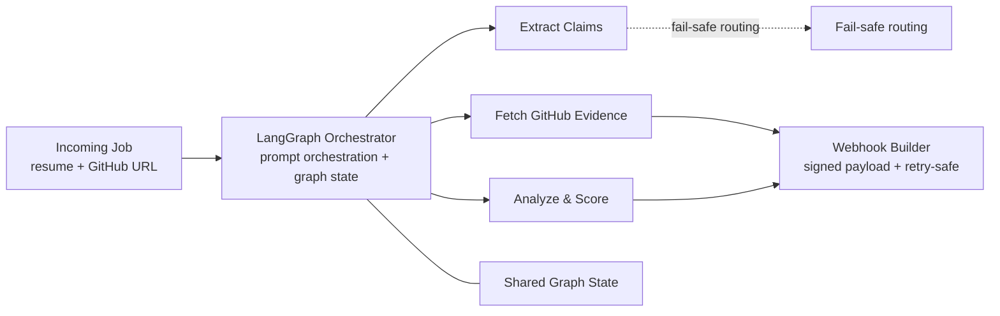
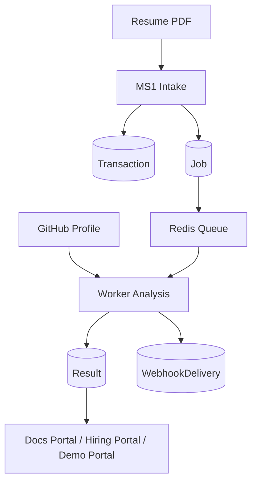
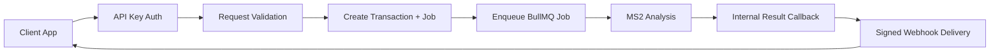

# ResumeProof

> **The trust layer for technical hiring.**
> A production-oriented verification platform that cross-checks a candidate's resume claims against GitHub evidence, computes a deterministic confidence score, and delivers signed results to hiring systems asynchronously.

[Live Demo](https://www.resumeproof.online/) · [License](LICENSE) · [Website](https://www.resumeproof.online/)

[](LICENSE)
[](#architecture-overview)
[](#technology-stack)

---

## Summary

ResumeProof is a multi-surface verification system for modern hiring workflows. It accepts a resume PDF and GitHub identity, validates and queues the request, analyzes the candidate's public code footprint, computes a structured result, stores the outcome, and notifies the client through a webhook.

The repository is organized as a monorepo with four major product surfaces:

- **MS1**: the public API gateway and transactional backend.
- **MS2**: the asynchronous verification worker and analysis engine.
- **Docs Portal**: the public marketing site and authenticated dashboard for API clients.
- **Hiring Portal**: a recruiter-facing demo experience that consumes ResumeProof results.
- **Demo Portal**: a separate end-to-end application that shows how a client app can submit candidates into the system.

---

## Live Demo

- **Production site:** [https://www.resumeproof.online/](https://www.resumeproof.online/)
- **Repository:** this workspace

---

## Problem Statement

Hiring teams often have to evaluate claims that are difficult to verify quickly:

- Does the candidate actually work in the stack listed on the resume?
- Are the showcased projects genuinely authored by the candidate?
- Is the GitHub footprint consistent with the career history presented in the CV?

Manual review is slow, inconsistent, and difficult to audit. ResumeProof addresses that gap by converting unstructured resume claims into a measurable, evidence-based verification workflow.

---

## Solution Overview

ResumeProof treats verification as a system design problem rather than a simple API call.

1. A client submits a resume and GitHub URL to **MS1**.
2. MS1 validates the request, stores a transaction, and pushes a job to **Redis** through **BullMQ**.
3. **MS2** consumes the job, extracts resume claims, fetches GitHub evidence, runs an AI-assisted verification pipeline, and calculates a confidence score.
4. MS2 persists the final result and posts it back to MS1 through an internal authenticated channel.
5. MS1 can later expose the result to the client via polling, dashboard views, or webhook delivery.

This design keeps the public API responsive while moving expensive analysis into an isolated worker tier.

---

## Key Features

- Resume PDF intake with validation and fail-fast parsing.
- API key-based request authentication for client integrations.
- JWT-based authenticated dashboard access for portal users.
- Asynchronous verification via Redis and BullMQ.
- AI-assisted GitHub and resume claim analysis with LangGraph orchestration.
- Deterministic confidence scoring with structured flags.
- Signed webhook delivery for downstream systems.
- Client dashboard for API keys, usage, profile, and webhook settings.
- Recruiter-facing hiring portal that visualizes candidate verification state.
- Separate demo portal showing how a customer application integrates with the API.
- Database-backed transactions, jobs, results, webhook deliveries, and audit logs.
- Telemetry and timing instrumentation in the gateway service.

---

## Architecture Overview

ResumeProof is built as a set of coordinated services rather than a single monolith.

- **MS1** owns client-facing API traffic, authentication, request validation, quota checks, transactional persistence, polling endpoints, and internal result intake.
- **MS2** owns the compute-heavy verification pipeline, external data retrieval, AI orchestration, score calculation, and webhook handoff back to MS1.
- **Docs Portal** gives API consumers a polished interface for onboarding and operational control.
- **Hiring Portal** simulates the recruiter-side consumer of verification results.
- **Demo Portal** demonstrates an integrated candidate application flow with webhook handling.

This separation improves fault isolation, keeps the public API responsive, and makes each surface independently deployable.

---

## High-Level System Architecture

The diagrams below mirror the attached architecture references from the project brief and the implementation in the repository.



### What each component does

- **Client App / ATS / Hiring Portal** submits the candidate resume payload and receives the verification outcome later.
- **MS1** authenticates the caller, validates the resume upload, creates the transaction record, and queues the work.
- **Redis + BullMQ** provides durable asynchronous scheduling between request intake and verification execution.
- **MS2** performs the expensive verification workflow using GitHub data, resume extraction, AI analysis, and score calculation.
- **PostgreSQL** stores the authoritative state: clients, API keys, transactions, jobs, results, webhook deliveries, and audit logs.
- **Signed Webhook Delivery** pushes verified results back to the client integration endpoint.

---

## Detailed Request Lifecycle



### Control flow notes

- The API returns **202 Accepted** so the client never waits on AI analysis.
- The job queue decouples request volume from worker throughput.
- MS2 updates the database before and after internal handoff so verification state is never only in memory.
- Webhook delivery is treated as a separate concern from verification success.

---

## Technology Stack

| Layer | Technologies | Purpose |
|---|---|---|
| Frontend portal | Next.js 14, React 18, Tailwind CSS, Axios | Marketing site, auth views, dashboard surfaces |
| Hiring portal | Next.js 16, React 19, Tailwind CSS, PostgreSQL client libraries | Recruiter-facing demo application |
| Demo portal frontend | React, Vite, React Router | Candidate submission and application UI |
| Demo portal backend | Node.js, Express, TypeScript | Demo application backend and webhook consumer |
| API gateway (MS1) | Node.js, Express, TypeScript, Prisma, BullMQ, Zod, OpenTelemetry, Helmet, CORS, Multer | Public API, validation, persistence, queueing, telemetry |
| Worker (MS2) | Python, FastAPI, LangGraph, LangChain ecosystem, Groq, PyGithub, httpx | Verification orchestration and analysis |
| Data layer | PostgreSQL | Clients, keys, transactions, jobs, results, webhooks, audit logs |
| Queueing | Redis, BullMQ | Asynchronous job execution |
| Auth | JWT, bcrypt, HMAC signatures | Client auth, dashboard sessions, signed webhook handling |
| Observability | Structured logging, timing middleware, OpenTelemetry hooks | Operational visibility and traceability |
| Deployment | Docker Compose, environment-based configuration | Local and production runtime orchestration |

---

## Folder Structure

```text
.
├── README.md
├── LICENSE
├── docker-compose.yml
├── prisma/
│   ├── schema.prisma
│   └── schema.sql
├── ms1/
│   ├── src/
│   │   ├── config/
│   │   ├── controllers/
│   │   ├── errors/
│   │   ├── jobs/
│   │   ├── middlewares/
│   │   ├── repositories/
│   │   ├── routes/
│   │   ├── schemas/
│   │   ├── services/
│   │   ├── types/
│   │   └── utils/
│   └── package.json
├── ms2/
│   ├── app/
│   │   ├── analyzers/
│   │   ├── services/
│   │   ├── utils/
│   │   └── workers/
│   └── requirements.txt
├── docs-portal/
│   ├── app/
│   ├── components/
│   └── lib/
├── hiring-portal/
│   ├── app/
│   ├── components/
│   ├── data/
│   └── lib/
└── demo-portal/
    ├── backend/
    └── frontend/
```

### How to read the tree

- **`ms1/`** contains the transactional backend and public API.
- **`ms2/`** contains the asynchronous analysis pipeline and worker runtime.
- **`docs-portal/`** contains the public site and authenticated dashboard.
- **`hiring-portal/`** contains a demo recruiter experience and local candidate data store.
- **`demo-portal/`** contains a separate end-to-end demo with a backend and frontend split.
- **`prisma/`** contains the canonical data model for the main backend.

---

## Application Workflow

### 1. Client onboarding
- A client registers from the Docs Portal.
- MS1 creates the client record, sends verification emails, and issues authentication tokens.
- The client generates one or more API keys and configures a webhook URL.

### 2. Verification submission
- The client application sends a resume PDF and GitHub URL to `POST /v1/verify`.
- MS1 authenticates the API key and validates that the upload is a PDF.
- MS1 persists a `Transaction` and `Job`, then returns a tracking identifier.

### 3. Worker processing
- MS2 pulls the job from Redis.
- The worker extracts resume claims, checks GitHub existence, fetches raw evidence, and executes the LangGraph pipeline.
- The analysis stage computes confidence, flags, matched skills, and supporting evidence.

### 4. Result persistence and delivery
- MS2 saves the `Result` and updates job/transaction status.
- MS2 posts the final result back to MS1 using the internal secret.
- MS1 signs and dispatches the webhook to the client endpoint.

### 5. Review and monitoring
- The client can poll verification status using the tracking ID.
- The Docs Portal dashboard shows profile, quota, webhook status, and API key management.
- The Hiring Portal shows recruiters candidate verification state and confidence score.

---

## Feature Walkthrough

### MS1 gateway
- Request validation using Zod and PDF magic-byte checks.
- API key authentication with hashed key lookup and prefix matching.
- JWT authentication for the client dashboard and settings routes.
- Quota enforcement for verification submissions.
- Transactional persistence for jobs and results.
- Internal result ingestion with a shared secret.
- Timing and telemetry hooks for request visibility.

### MS2 worker
- Background worker lifecycle managed by FastAPI lifespan hooks.
- Resume extraction and claim normalization.
- GitHub verification and repository evidence collection.
- LangGraph orchestration with fallbacks and terminal error handling.
- Confidence score computation based on evidence and flags.
- Database updates plus webhook handoff back to MS1.

### Docs Portal
- Marketing homepage.
- Sign-in and registration flow.
- Dashboard overview with usage meter and profile state.
- Webhook configuration and API key management screens.
- API-oriented copy that explains the product for integrators.

### Hiring Portal
- Public candidate flow.
- Admin dashboard with a local data source.
- Status view that surfaces verification lifecycle and confidence.
- Webhook receiver for signed result updates.

### Demo Portal
- Applicant submission frontend.
- Demo backend that forwards a resume to ResumeProof.
- Local candidate persistence and webhook receiver.

---

## Core Modules

### MS1
- `config/`: environment parsing, Redis, Prisma, telemetry, and metrics.
- `controllers/`: request handlers for verification, auth, keys, usage, settings, internal callbacks, and admin.
- `middlewares/`: API key auth, JWT auth, admin auth, upload handling, quota enforcement, response timing, and request validation.
- `repositories/`: data access for keys, clients, transactions, results, jobs, and webhooks.
- `services/`: business logic for verification, email, JWT, API keys, queueing, PDFs, audit logs, and webhooks.
- `routes/`: versioned routing and route composition.
- `jobs/`: scheduled cleanup of stale data.
- `utils/`: tracking IDs, logging, and PDF validation helpers.

### MS2
- `analyzers/`: claim extraction, GitHub data analysis, quality analysis, AI verification, and confidence scoring.
- `services/`: database and webhook delivery helpers.
- `workers/`: queue consumer entry point.
- `utils/`: GitHub and logging support.

### Docs Portal
- `app/`: Next.js App Router pages for marketing, login, registration, reset flows, docs, and dashboard.
- `components/`: reusable UI blocks for keys, usage, navigation, and API code samples.
- `lib/`: API client, auth token helpers, site copy, and shared types.

### Hiring Portal
- `app/`: recruiter UI, status pages, and internal API routes.
- `components/`: home and status visual components.
- `data/`: local candidate dataset.
- `lib/`: candidate store utilities and types.

### Demo Portal
- `backend/`: Express API that forwards applications to ResumeProof.
- `frontend/`: React app that simulates a customer-facing application flow.

---

## Authentication & Authorization

ResumeProof uses multiple auth layers because different actors have different trust boundaries.

### Client API authentication
- Public API consumers authenticate via `x-api-key` on MS1 verification and polling endpoints.
- API keys are stored hashed in PostgreSQL and matched by prefix plus bcrypt comparison.
- MS1 supports active key rotation and key revocation.

### Dashboard authentication
- Client-facing dashboard routes use JWT access tokens and refresh tokens.
- Auth flows include register, email verification, login, refresh, logout, forgot-password, and reset-password.
- Settings and usage endpoints are protected by JWT middleware.

### Internal service authentication
- MS2 posts results back to MS1 using `X-Internal-Secret`.
- MS1 rejects internal writes if the secret does not match the configured value.

### Webhook verification
- Client webhook receivers can validate delivery payloads with HMAC signatures.
- The demo and hiring surfaces both include webhook handlers that verify message integrity before accepting results.

---

## Database Design

The primary Prisma schema models the verification workflow explicitly.

| Model | Purpose |
|---|---|
| `Client` | Customer account, plan, webhook URL, webhook secret, and relationships to keys, transactions, deliveries, and audit logs. |
| `ApiKey` | Hashed API keys with prefix, label, rotation state, and last-used metadata. |
| `Transaction` | One verification request, including tracking ID, GitHub URL, resume metadata, and lifecycle status. |
| `Job` | Queue-level execution state with BullMQ job ID, retry metadata, and timestamps. |
| `Result` | Final confidence score, flags, evidence payloads, and computed verification output. |
| `WebhookDelivery` | Delivery attempt history, response metadata, retry scheduling, and success state. |
| `AuditLog` | Event stream for important client actions and system activity. |

### Design notes

- Transactions and jobs are separated so request intake and worker execution can evolve independently.
- Results are stored separately from transactions to support retries and richer analysis payloads.
- Webhook delivery history is first-class so operators can reason about failure modes.
- Audit logs provide an operational trail for sensitive actions like key creation and verification submission.

---

## API Overview

### Public client API on MS1

| Method | Endpoint | Purpose |
|---|---|---|
| `POST` | `/v1/auth/register` | Register a client account. |
| `GET` | `/v1/auth/verify-email` | Verify a new account via token. |
| `POST` | `/v1/auth/login` | Create a dashboard session. |
| `POST` | `/v1/auth/refresh` | Rotate the access token. |
| `POST` | `/v1/auth/logout` | Revoke a refresh token. |
| `POST` | `/v1/auth/forgot-password` | Request a password reset. |
| `POST` | `/v1/auth/reset-password` | Complete a password reset. |
| `POST` | `/v1/keys/generate` | Generate a new API key. |
| `GET` | `/v1/keys` | List API keys. |
| `DELETE` | `/v1/keys/:keyId` | Revoke an API key. |
| `GET` | `/v1/settings/profile` | Fetch dashboard profile details. |
| `POST` | `/v1/settings/webhook` | Update webhook configuration. |
| `GET` | `/v1/usage` | Fetch quota and usage stats. |
| `POST` | `/v1/verify` | Submit a verification request. |
| `GET` | `/v1/verify/:trackingId` | Poll verification status. |
| `POST` | `/internal/result` | Accept the worker result from MS2. |

### Administrative API on MS1

- `/v1/admin/auth`
- `/v1/admin/stats`
- `/v1/admin/clients`
- `/v1/admin/jobs`
- `/v1/admin/system`

### Supporting routes

- `/health` for readiness-style health checks.

### Example request flow

```bash
curl -X POST http://localhost:7000/v1/verify \
  -H "x-api-key: rp_live_your_key_here" \
  -F "resume=@resume.pdf" \
  -F "githubUrl=https://github.com/user/repo"
```

---

## Validation Strategy

ResumeProof validates requests at multiple layers to fail early and keep bad data out of the pipeline.

- **File validation**: MS1 checks that uploads exist and match PDF magic bytes.
- **Payload validation**: Zod schemas validate auth, settings, key, and verification request bodies.
- **Auth validation**: API keys, JWTs, and internal secrets are all checked in dedicated middleware.
- **Webhook validation**: delivery receivers verify HMAC signatures before processing payloads.
- **Worker validation**: MS2 routes the graph through a terminal error path if any stage fails.

This layered strategy prevents malformed requests from reaching the queue or analysis stages.

---

## Error Handling Strategy

- Application errors use a shared `AppError` type in MS1.
- Unmatched routes fall through to a structured 404 error.
- Global error middleware formats responses consistently.
- MS2 catches node-level exceptions and routes to a terminal error node.
- Webhook delivery failures are logged and stored so the analysis pipeline does not disappear with a transient callback failure.
- The hiring and demo portals return explicit JSON errors for invalid forms, missing configuration, and signature mismatches.

---

## Security Considerations

- API keys are stored hashed, not in plaintext.
- API key prefixes separate live and test-style credentials.
- JWT secrets, internal secrets, and webhook secrets are separated by responsibility.
- HMAC signatures protect webhook payload integrity.
- Dashboard endpoints are isolated behind JWT middleware.
- PDF uploads are validated before processing.
- CORS and Helmet are enabled in MS1.
- Refresh token rotation and revocation are supported.
- The worker uses an internal secret when reporting results back to MS1.

---

## Performance Optimizations

- Verification requests return `202 Accepted` instead of blocking on analysis.
- BullMQ offloads expensive verification to a worker queue.
- MS2 runs as a background consumer so compute-heavy tasks do not affect request latency.
- Prisma transactions keep multi-step database writes consistent.
- Response timing middleware and telemetry improve operational visibility.
- The worker and gateway can be scaled independently if traffic increases.
- The Docs Portal caches state on the client side and only fetches dashboard data when needed.

---

## Scalability Considerations

- **Horizontal gateway scaling**: MS1 can scale independently from MS2.
- **Worker scaling**: additional MS2 workers can consume the same Redis queue.
- **Database growth**: the schema separates transactional state from result payloads and delivery logs.
- **Operational isolation**: public API traffic, background compute, and portal traffic are separated by service.
- **Webhook resiliency**: delivery attempts are tracked so retries can be reasoned about later.

---

## Design Decisions & Trade-offs

### Why asynchronous verification?
A resume-to-GitHub analysis can take time. Returning immediately keeps the API responsive and makes the system usable under load.

### Why split MS1 and MS2?
The public API and the verification worker have different failure modes, resource profiles, and deployment needs. Splitting them reduces blast radius.

### Why use both deterministic rules and AI?
The pipeline combines structured signals with AI-assisted interpretation. That keeps the final score explainable while still capturing nuanced patterns.

### Why store results separately from transactions?
It allows the system to preserve request state even if result generation or webhook delivery is retried later.

### Why keep the demo portal separate?
The demo application shows how a client integration behaves without coupling it to the main product portal.

---

## Environment Variables

### MS1

| Variable | Required | Purpose |
|---|---|---|
| `DATABASE_URL` | Yes | PostgreSQL connection string for the main backend. |
| `REDIS_URL` | Yes | BullMQ and queue connection string. |
| `MS1_PORT` | Yes | Public API port. |
| `NODE_ENV` | No | Runtime environment (`development`, `production`, `test`). |
| `SMTP_HOST` | Yes | Mail server host for account emails. |
| `SMTP_PORT` | Yes | Mail server port. |
| `SMTP_USER` | Yes | SMTP username. |
| `SMTP_PASS` | Yes | SMTP password. |
| `SMTP_FROM` | No | Email sender address. |
| `DOCS_PORTAL_URL` | Yes | Public portal URL used in email links. |
| `JWT_SECRET` | Yes | JWT signing secret. |
| `JWT_ACCESS_TTL` | No | Access token lifetime. |
| `JWT_REFRESH_TTL` | No | Refresh token lifetime. |
| `INTERNAL_SECRET` | Yes | Shared secret for MS2 internal callbacks. |
| `OTEL_ENABLED` | No | Enables OpenTelemetry export. |
| `OTEL_EXPORTER_OTLP_ENDPOINT` | No | OTLP collector endpoint. |
| `OTEL_EXPORTER_OTLP_HEADERS` | No | OTLP auth headers. |
| `LOG_LEVEL` | No | Logger verbosity. |

### MS2

| Variable | Required | Purpose |
|---|---|---|
| `REDIS_URL` | Yes | Queue connection string. |
| `DATABASE_URL` | Yes | Main PostgreSQL connection string. |
| `GROQ_API_KEY` | Yes | AI model access key. |
| `GITHUB_TOKEN` | Yes | GitHub API token used by the worker. |
| `INTERNAL_SECRET` | Yes | Shared secret for MS1 callbacks. |
| `MS1_INTERNAL_URL` | Yes | Internal MS1 base URL. |
| `MS2_PORT` | No | Worker service port. |

### Docs Portal

| Variable | Required | Purpose |
|---|---|---|
| `NEXT_PUBLIC_API_URL` | No | Base URL for MS1 API requests. |

### Hiring Portal

| Variable | Required | Purpose |
|---|---|---|
| `DATABASE_URL` | Yes | Candidate data store. |
| `ADMIN_KEY` | Yes | Admin dashboard access key. |
| `RESUMEPROOF_API_KEY` | Yes | API key used when forwarding applications to MS1. |
| `RESUMEPROOF_API_URL` | Yes | ResumeProof API base URL. |
| `NEXT_PUBLIC_APP_URL` | No | Public origin used to construct webhook URLs. |
| `WEBHOOK_SECRET` | Yes | Secret used by the webhook receiver. |

### Demo Portal Backend

| Variable | Required | Purpose |
|---|---|---|
| `DEMO_DATABASE_URL` | Yes | Demo backend database connection string. |
| `DEMO_PORT` | No | Demo backend port. |
| `RESUMEPROOF_API_KEY` | Yes | API key used to submit verification requests. |
| `RESUMEPROOF_API_URL` | Yes | ResumeProof API base URL. |
| `WEBHOOK_SECRET` | Yes | HMAC secret for webhook verification. |

### Demo Portal Frontend

| Variable | Required | Purpose |
|---|---|---|
| `VITE_API_URL` | No | Browser-side API base URL. |

---

## Installation Guide

### Prerequisites

- Node.js 18+ for the TypeScript and Next.js apps.
- Python 3.10+ for MS2.
- PostgreSQL.
- Redis.
- A Groq API key for the worker.
- A GitHub token for worker-side GitHub API access.

### Install dependencies

```bash
# Root-level package manager metadata
npm install

# MS1
cd ms1
npm install

# Docs Portal
cd ../docs-portal
npm install

# Hiring Portal
cd ../hiring-portal
npm install

# Demo Portal frontend
cd ../demo-portal/frontend
npm install

# Demo Portal backend
cd ../demo-portal/backend
npm install

# MS2 Python environment
cd ../ms2
python -m venv .venv
.venv\Scripts\activate
pip install -r requirements.txt
```

---

## Local Development Setup

### 1. Start infrastructure

```bash
docker compose up -d
```

### 2. Configure environment files

Create the required `.env` or local env files for each service based on the tables above.

### 3. Run MS1

```bash
cd ms1
npm run dev
```

### 4. Run MS2

```bash
cd ms2
uvicorn app.main:create_app --factory --reload --host 0.0.0.0 --port 3002
```

### 5. Run the Docs Portal

```bash
cd docs-portal
npm run dev
```

### 6. Run the Hiring Portal

```bash
cd hiring-portal
npm run dev
```

### 7. Run the Demo Portal

```bash
cd demo-portal/backend
npm run dev

cd ../frontend
npm run dev
```

---

## Production Deployment Guide

The repository is designed to support a multi-service deployment model.

### Suggested production topology

- **MS1** behind a public HTTP reverse proxy.
- **MS2** as a private worker process with outbound access to GitHub, Groq, and MS1 internal routes.
- **PostgreSQL** as the shared persistent data store.
- **Redis** as the job queue.
- **Docs Portal** and **Hiring Portal** as separate web applications.
- **Demo Portal** as an optional showcase stack.

### Deployment checklist

- Provision PostgreSQL and Redis.
- Set all secrets in the target environment.
- Configure SMTP credentials for email flows.
- Point portal base URLs to production MS1 endpoints.
- Expose only the public gateway and web apps.
- Keep `INTERNAL_SECRET` private to MS1 and MS2.
- Enable monitoring and log aggregation.
- Rotate API keys and webhook secrets per client.

### Build commands

```bash
cd ms1 && npm run build
cd docs-portal && npm run build
cd hiring-portal && npm run build
cd demo-portal/frontend && npm run build
```

MS2 is Python-based and is started directly with its application entry point.

---

## Build Process

- **MS1** compiles TypeScript to `dist/` and starts from `dist/server.js`.
- **Docs Portal** uses Next.js production builds.
- **Hiring Portal** uses Next.js production builds.
- **Demo Portal frontend** uses Vite's production build pipeline.
- **Demo Portal backend** runs as a Node.js service.
- **MS2** runs as a Python worker application with FastAPI lifecycle management and background queue consumption.

---

## Project Screenshots

Screenshots were not provided in the repository, so this section is intentionally minimal.

- Live product experience: [https://www.resumeproof.online/](https://www.resumeproof.online/)
- Recommended placement: add screenshots of the Docs Portal, verification workflow, and recruiter dashboard here once exported.

---

## Architecture Diagram

The attached architecture images in the project brief informed the system description in this README. The Mermaid diagrams above mirror the same request flow, queue handoff, AI pipeline, and webhook delivery behavior.

### LangGraph pipeline



### Why this graph exists

- The orchestration layer makes each stage explicit and testable.
- Resume extraction, GitHub evidence, and score calculation are separable concerns.
- Fail-safe routing ensures a broken branch can terminate cleanly.
- Shared graph state lets each stage enrich the same verification context.

---

## Data Flow Diagram



---

## API Flow Diagram



---

## Testing Strategy

The repository currently emphasizes runtime and integration behavior over isolated unit test coverage.

### Recommended coverage layers

- **Gateway tests**: authentication, validation, and request lifecycle checks for MS1.
- **Worker tests**: analyzer behavior and error-path coverage for MS2.
- **Portal tests**: dashboard rendering and form submission flows.
- **Integration tests**: end-to-end verification from application submission to webhook receipt.

### Practical checks already present in the codebase

- Manual test scripts in `ms1/` and `ms2/scripts/`.
- Request validation in middleware and route handlers.
- Webhook verification logic in the portal receivers.

---

## Known Limitations

- The worker pipeline depends on external GitHub and Groq services.
- Some portal data is still driven by local/demo storage rather than a unified client backend.
- Screenshot assets are not committed in this repository.
- The README diagrams are reconstructed in Mermaid because the provided architecture images are not stored in the repo.
- Production-ready observability and alerting are only partially represented in code.

---

## Future Roadmap

- Add automated integration tests for the verification lifecycle.
- Expand dashboard telemetry and operational analytics.
- Harden rate limiting and abuse detection at the gateway.
- Add richer client-level SLA and quota reporting.
- Improve worker retry introspection and dead-letter handling.
- Add versioned webhook schemas and delivery replay tooling.
- Introduce UI component tests for portal flows.

---

## Contribution Guide

Contributions should follow a small, reviewable commit style.

1. Fork the repository.
2. Create a feature branch.
3. Keep commits atomic and scoped to a single concern.
4. Add or update tests when behavior changes.
5. Open a pull request with a clear description of the user-facing impact.

Recommended commit style:

```bash
git commit -m "feat(ms1): add webhook retry tracking"
```

---

## Acknowledgements

- Built with the Next.js, Express, FastAPI, PostgreSQL, and Redis ecosystems.
- Inspired by production verification and developer-experience patterns used in modern SaaS platforms.
- The architecture brief and diagrams guided the documentation structure for this README.

---

## License

This project is licensed under the [MIT License](LICENSE).

---

## Author

**Mohd Rizwan**

---

## Contact

- Website: [https://www.resumeproof.online/](https://www.resumeproof.online/)
- Repository: this workspace

---

<details>
<summary>Footer</summary>

ResumeProof is designed as a portfolio-grade verification platform for technical hiring.

- Current focus: evidence-based resume verification
- System model: gateway + queue + worker + dashboards
- Primary goal: make hiring claims auditable

</details>
